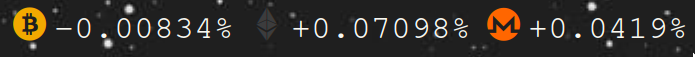
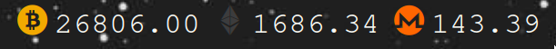
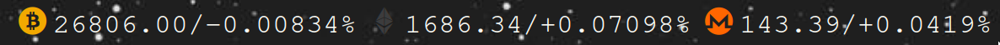
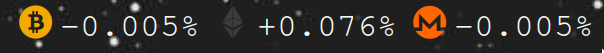

# polybar-crypto
A *polybar script* that displays the price or percentage change of various **crypto-currencies**.



# Setup
```
git clone https://github.com/carl-a-van-roosbroeck/polybar-crypto &&
    cd polybar-crypto &&
    mkdir -p ~/.config/polybar &&
    cp ./{crypto-config,crypto.py} ~/.config/polybar &&
    sudo chmod u+x ~/.config/polybar/crypto.py
```

Then in `~/.config/polybar/config`:

```
[bar/top]

...

modules-left = crypto

...

[module/crypto]
type = custom/script
interval = 300
exec = /home/<user>/.config/polybar/crypto.py

```

## Dependencies
The [cryptocoins](https://github.com/allienworks/cryptocoins) *icon font* is used in the screenshots, though you are free to use any other font.

If using the **cryptocoins** icon font, ensure that the following line is present in your `~/.config/polybar/config`:

```
[bar/top]

...

font-2 = cryptocoins:style=Regular;0
```

# Example Configuration

`~/.config/polybar/crypto-config`
```
[general]
base_currency = EUR
display = percentage
round = 3

[bitcoin]
icon = 
color = #f2a900

[ethereum]
icon = 
color = #3c3c3d

[monero]
icon = 
color = #ff6600
```

## Display Modes

`display = price`



`display = percentage`


`display = both`



## Rounding

`round = 0` No rounding
`round = {n}` Round


*for example*

`round = 3`




## Color

`color = {hex color}` Set the color of the symbol

